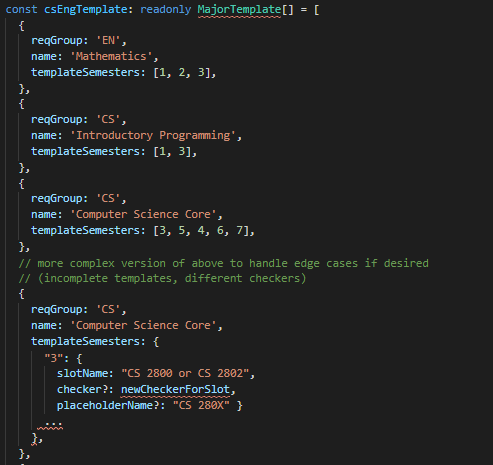

## Data Format

By: Will Spencer?

Create a new data folder (templates) with a file for each template we have

Parameters

- `reqGroup`: acronym in the requirements json req is stored in (see `index.ts` in data folder)
- `name`: name of the requirement in that file, must be unique
- `placeholderSemesters` (basic version) semesters that should have a placeholder course with this requirement
  - Functionality will match `perSlotMinCount`
    - If a course is `perSlotMinCount: [1, 1]` like Introductory Programming
      - The first semester in `placeholderSemesters` will have the CS 111x requirement, the second semester will have the CS 211x requirement
    - If a course is `perSlotMinCount: [3]` like External Specialization
      - Each semester in `placeholderSemesters` will have the same checker

Complex Parameters

Below is a more complex `placeholderSemesters` that could be implemented if we wanted additional information because of more complex templates in a version 2.

- `placeholderSemesters` - semesters and data about each slot in that requirement
  - Key would be the semester that should have the following information
  - `slotName` would be the name of the slot that should be applied to that semester from the requirement (instead of the order having to match). This would allow more flexibility if not every slot was included in a template
  - `checker` (optional) - could define a new checker in the file and set it here
    - Useful if a checker on a placeholder should ever be different than a requirement (CS broad electives, any other examples?)
  - `placeholderName` (optional) - set the name of the placeholder to be different than the slot
    - Useful if the slot name is too long, as it is more of a description than a title

Issues with the above parameters and resolutions

- Requirements fulfilled by credits (Major approved free elective)
  - Treat it as if it is the number of courses as the length of `placeholderSemesters`
  - i.e. include a course in each semester provided by `placeholderSemesters` and if they do not pick courses that fulfill the credit count, the requirement will not show up fulfilled on requirement bar.
- Double counting (Probability requirement)
  - Do not include these requirements in the template, as they are not in the CS engineering handbook template
- Compound requirements
  - ?? Resolve as they come up

Rationale for this format

- Cannot just update a major file, as templates are dependent on university, college, and major
  - For example, CS templte includes FWS and PE courses, which are in the engineering college and university requirements respectively
- Placeholder names do not need to be a separate parameter
  - Names of the placeholders can simply be slotNames if included, or the name of the requirement if not
    - Ex. Math requirement has slot names "Math 1910," "Math 1920", and "Math 2930 or Math 2940"
    - Ex. Computing requirement does not, would be "Computing"

## Questions to Resolve

Can we determine that a course should not be a placeholder if the checker only returns 1 course?

This should maybe be a version 2? Talked to @Benjamin Shen who brought up issues on the requirements side of things, as this would be a mass add of courses and removes any requirement choices

Is anything initially included besides engineering majors? If so, how do we handle that structure?

No - only engineering courses at first

What happens if someone changes or deletes their major? Does the template go away?

Could just get rid of the placeholders that have not been turned into courses

**Problem: What if someone is a double major?** Would need to identify which placeholders correspond to which major if only 1 deleted

Resolution: Have people opt-in to templates for 1 of their majors, selected during onboarding

What if someone does not have 8 semesters per Vaish's change?

Auto-create and populate missing semesters, as users can always edit what is created for them

What if we have templates that have their own checkers?

Could be useful for something like CS electives where the placeholders are more broad than the requirements are - "Major Electives" combine technical, project, > 4000+, external, etc.

Would be resolved by the more complex format above

Is there a scenario in which templates might not be complete? Or will we handle every requirement & slot for a college/major

No, should be complete!

How do we handle requirements that are shared between a college and major, like Computing in Eng and Introductory Programming

Current plan is to exclude the double countable one if possible

Potential future idea from @Benjamin Shen : since removing data when we notice an overlap is not systematic/more pront to error - Intentionally check for "duplicate" placeholders (comparing the checkers and seeing if the requirements are not in a constraint) before adding them. This might also work better if we want to support simultaneous templates in the future; for example, two templates for a double major in the same college would necessarily have overlapping placeholders for the university and college.

## Product and Design Responses

Are templates just for engineering majors right now? Or are we considering other schools, or minors, or anything else?

Starting with engineering for now as roadmaps are easily available for v1. We will expand to other schools in the future. Unclear on minors for now (we can see how it goes) as I don't think roadmaps are v common with them.

How do we handle people that are double majoring? Placeholders can get really complicated if we want people to add two templates in their plan.

Let's not include this in v1.

Design: double majors, dropdown to pick which major you want during onboarding

Can people turn off templates? If so, what is the behavior?

@Kehui Guo

Choose all semesters (Add Template feature) or add none

If user goes back to chose templates and they have already existing semesters, would remove all placeholders in their plan

Maybe show a warning after you finish onboarding?

For templates that let class 1 or class 2 be offered in a slot, do designs accommodate that? (The term "major electives" on the CS template represents a number of different requirements on CP)

@Kehui Guo

We can just set a order arbitrarily (within reason)

We can make clear it's a recommendation (with hover warning sign tooltip with note)

Is it ok if everything added to a plan from templates is a placeholder course, even if the checker only resolves to one course? For example, the Math 1910 requirement only allows Math 1910 to fulfill it - is it ok if we put a placeholder with that title where users still need to click through an add modal to confirm it goes on their plan? Think there are reqs issues if we do not do this

(explain more)

Yes, I think it should be okay. Not ideal but fine for v1!

Ideally: IF we have Math 1910 → Show up as Math 1910

Do not need to worry about other requirement decisions - choose for them like we do from the self check add modal

**Template Designs Here:**

[**https://www.figma.com/file/Eo0DlT9Lty9Sbvhwhal8pk/Kehui-Working-File?node-id=518%3A3854**](https://www.figma.com/file/Eo0DlT9Lty9Sbvhwhal8pk/Kehui-Working-File?node-id=518%3A3854)

## Step-by-step Action Plan

Note that more details are listed on the linked items

1. Finalize front-end design, requirements data structure, and the above questions - by 11/2
2. Create more template data for a couple more engineering majors, resolve any data discrepancies as needed
   1. Will - finish CS: [Create CS Template Data](https://www.notion.so/Create-CS-Template-Data-668f8dfbde56456ebae718b6e07635e4)
   2. Aryan - do ECE: [Create an ECE Template file](https://www.notion.so/Create-an-ECE-Template-file-1cdd5298455b4968a709f6a947f5656c)
3. Create placeholder course versions (Will): [Create Placeholder Courses](https://www.notion.so/Create-Placeholder-Courses-1455168eb411449d95e42269461479fe)
   1. Lots of not required fields, but should be similar to course in Firestore
4. Process the template data in some way (Aryan): [Investigate processing Template Data](https://www.notion.so/Investigate-processing-Template-Data-05fb0bd2c499482399a89015624fc3e6)
5. Click placeholders to open up a new add modal (Will): [Templates add modal](https://www.notion.so/Templates-add-modal-6bf6a2cb928047db89bc029644190264)
6. Populate add modal with the checker corresponding to the placeholder (Aryan): [Populate Template Add Modal](https://www.notion.so/Populate-Template-Add-Modal-fc96bb1293ac4dc4aa68fb7725b39753)
7. Add templates to the onboarding modal (Will): [Add Templates to Onboarding](https://www.notion.so/Add-Templates-to-Onboarding-7cd76af4129849feac1b8a60cd67f597)
8. Generate placeholders from modal selection and put into schedule (Aryan): [Generate placeholders](https://www.notion.so/Generate-placeholders-270337fd71db47bc87061110d0c6708e)
9. Write unit tests on requirements side (Aryan) and front-end side (Will) : [Add Templates unit tests](https://www.notion.so/Add-Templates-unit-tests-426bbbc8a48b4efd8fb2d86a8a600c2f)
10. Add more data!!! (Will & Aryan): [Add Templates data](https://www.notion.so/Add-Templates-data-99d48fdbf4f6413e830519f9a7423916)
